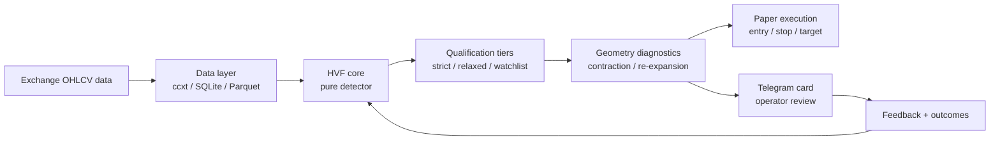
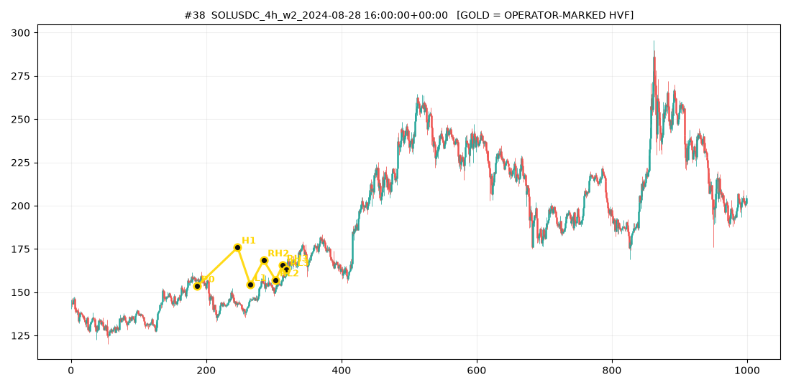

# HVF Sniper — Algorithmic Trading System

> A research-stage crypto trading system for detecting Hunt Volatility Funnel (HVF) structures, filtering candidates, and delivering explainable Telegram diagnostics.
>
> **Development status:** actively developed · paper/research mode · no public source release

## What this showcases

HVF Sniper combines:

- Bespoke six-pivot HVF/iHVF structure detection
- Strict and relaxed qualification tiers
- Multi-timeframe market scanning
- Candidate geometry and contraction diagnostics
- Paper-trading and risk-control components
- Telegram alert cards with human-readable explanations
- Operator feedback loops for validating detector behavior

The production repository remains private while the detector and execution workflow continue to evolve. This repository is intentionally a **portfolio showcase**, not a source-code mirror.

## Architecture



## Detection model

A candidate is represented by alternating pivots forming a contracting funnel:

```text
Bullish: L0 → H1 → RL1 → RH2 → RL2 → RH3 → RL3
Bearish: H0 → L1 → RH1 → RL2 → RH2 → RL3 → RH3
```

The system evaluates structural monotonicity, retracement qualification, impulse timing, funnel geometry, and breakout conditions. Diagnostics are kept separate from hard rejection logic so empirical findings can be measured before they affect alerts or trades.

## Validation snapshot

The latest internal validation round produced:

- 69 operator-marked positive candidates
- Contraction diagnostic reproduced all 69 operator cH values
- `cH ≤ 0.80`: 69/69 positive candidates passed
- Amp re-expansion was retained as a risk flag, not a hard rejection
- Latest full automated suite: **1,476 passed / 0 failed**

These are development measurements, not trading performance claims. The project is not presented as profitable or production-ready.

## Screenshots

### Operator-marked HVF geometry



The gold path shows the six-pivot structure used for detector and feedback-loop validation.

## Current development focus

- Resolve and classify remaining operator-reviewed outcomes
- Measure whether geometry flags add predictive value beyond the base rate
- Deduplicate overlapping scan windows
- Continue hardening paper execution and safety gates
- Keep the detector, data, and execution layers independently testable

## Technology

`Python 3.11+` · `uv` · `pandas` · `numpy` · `ccxt` · `SQLite` · `Parquet` · `FastAPI` · `pytest` · `Telegram`

## Related public work

- [WhisperFlow](https://github.com/mooe20-commits/WhisperFlow) — local-first macOS voice-to-text dictation
- [sr16-bridge](https://github.com/mooe20-commits/sr16-bridge) — local BLE health-data bridge

## Contact

Michal Pelc · AI Automation Engineer · Python · LLM agents · algorithmic trading systems
